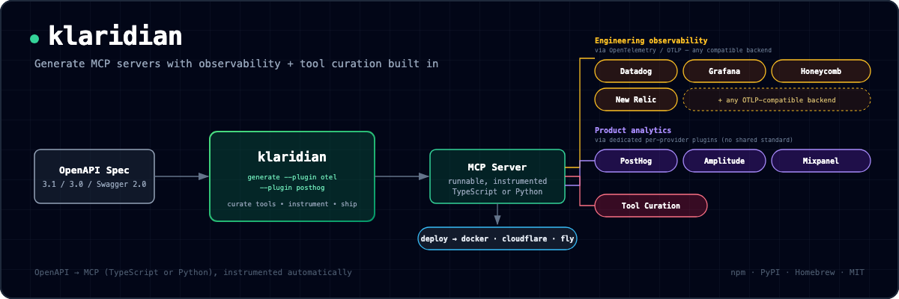

# mcpforge

[](https://github.com/ricardocvasconcelos/mcpforge/actions/workflows/ci.yml)



> Generate MCP servers with engineering + product observability built in — no manual instrumentation.

**Status:** Working v0. Generates real, runnable [Model Context Protocol](https://modelcontextprotocol.io) servers from an OpenAPI spec, optionally instrumented with OpenTelemetry and/or PostHog, with generation-time tool curation. See [PLAN.md](PLAN.md) for the strategic plan and [ARCHITECTURE.md](ARCHITECTURE.md) for technical design + validation history.

## What is this?

`mcpforge` is a CLI that generates MCP servers — from an OpenAPI spec — with observability and tool curation wired in from the start:

- **Engineering observability** (`otel` plugin) — OpenTelemetry spans for every tool call, exportable via OTLP to Datadog, Grafana, Honeycomb, New Relic, or any other OTLP-compatible backend. Latency, errors, and status per call, with zero manual instrumentation. One plugin reaches every backend here because OTel/OTLP is a genuine open wire protocol.
- **Product observability** — an event per tool call (`tool_name`, `duration_ms`, `success`) captured by whichever provider you pick: `posthog`, `amplitude`, or `mixpanel` plugins. Unlike OTel, there's no shared standard for product analytics ingestion, so this is three separate plugins rather than one — see [ARCHITECTURE.md section 26](ARCHITECTURE.md#26-two-more-product-analytics-plugins-amplitude-mixpanel--and-why-product-analytics-needed-more-than-one-unlike-engineering-observability-aug-30-2026) for why that's a structural difference, not an oversight.
- **Tool curation** — choose which OpenAPI operations become tools at generation time (`--include-tags`, `--exclude-tags`, `--exclude-operation-ids`, or an interactive prompt), so you don't ship every operation in a large spec as a tool by default.

You pick the plugins you want at generation time — e.g. `--plugin otel --plugin posthog`, or `--plugin otel --plugin amplitude --plugin mixpanel` (any combination composes automatically). The server that comes out the other end is already instrumented.

OpenAPI parsing and MCP server code generation are handled by [`openapi-mcp-generator`](https://github.com/harsha-iiiv/openapi-mcp-generator); mcpforge's own code is the instrumentation and curation layer on top of that output.

## Why

Building an MCP server today means writing the server, then manually wiring up tracing and analytics — repetitive work every MCP server author does from scratch. Datadog, PostHog, Sentry, and Grafana already ship MCP servers of their own, but those let an agent *query* those platforms — they don't instrument a *new* server you're building. `mcpforge` closes that gap.

## Quickstart

```bash
cd packages/cli
npm install
npm run build

# Generate an MCP server from an OpenAPI spec, with OTel + PostHog instrumentation:
node dist/src/index.js generate \
  --spec ../../examples/petstore/openapi.json \
  --out /tmp/my-generated-server \
  --name my-petstore-server \
  --base-url https://petstore3.swagger.io/api/v3 \
  --plugin otel --plugin posthog \
  --plugin-config otel.serviceName=my-petstore-server

# Then run the generated server:
cd /tmp/my-generated-server
npm install && npm run build
export OTEL_EXPORTER_OTLP_ENDPOINT=http://localhost:4318/v1/traces   # optional, has a default
export POSTHOG_API_KEY=phc_your_project_key
npm start
```

Omit `--plugin` entirely to generate a plain, un-instrumented server. Add `--include-tags`, `--exclude-tags`, `--exclude-operation-ids`, or `--interactive` to curate which operations become tools — see [ARCHITECTURE.md section 25](ARCHITECTURE.md#25-tool-curation-implemented-and-validated-end-to-end-aug-30-2026) for details.

Every generated server ships with a real `LICENSE` file and a `package.json.license` field by default (`--license mit`, or `--license apache-2.0`; `--license none` opts out but prints a warning) — MCP servers run with real credentials next to an autonomous agent, so being open/auditable by default matters more than for a typical scaffolded project. `--author "Your Name"` sets the copyright holder (falls back to `git config user.name`). See [PLAN.md section 7](PLAN.md#7-distribution-norm-why-mcp-servers-are-conventionally-open-source-and-what-that-implies-for-mcpforge-aug-30-2026) and [ARCHITECTURE.md section 27](ARCHITECTURE.md#27-generated-server-license--packagejson-license-field-aug-30-2026) for why.

## Repository layout

```
mcpforge/
├── packages/
│   └── cli/                # the mcpforge CLI
│       ├── src/
│       │   ├── render/instrument.ts  # patches the generated server output to wire in a plugin
│       │   ├── plugins/    # ObservabilityPlugin interface + plugins (otel, posthog)
│       │   ├── curation/   # tool curation logic + interactive prompt
│       │   └── commands/   # the `generate` CLI command
│       └── test/           # end-to-end tests (real npm install + build + run)
│   └── python-posthog-middleware/  # FastMCP-native PostHog middleware (Python) — no generation/patching, see ARCHITECTURE.md section 23
├── examples/
│   └── petstore/           # real OpenAPI spec used as the test fixture throughout
├── spike/                  # throwaway hand-written spike that validated the core mechanic first
├── PLAN.md                 # business/strategy plan
├── ARCHITECTURE.md         # technical design, decisions, and validation history
└── CLAUDE.md               # working agreements for AI agents contributing to this repo
```

## Status & roadmap

Working v0: OpenAPI → MCP server generation, a tested OpenTelemetry + PostHog instrumentation layer, and generation-time tool curation. See [ARCHITECTURE.md](ARCHITECTURE.md) for the full decision history, including the original hand-rolled OpenAPI mapper (superseded, kept for context).

**Validated against real-world specs:** including a large, complex production API (100+ operations, heavy `allOf` usage, Bearer auth, binary responses) — see [ARCHITECTURE.md section 16](ARCHITECTURE.md#16-strategic-pivot-adopt-openapi-mcp-generator-as-the-generation-engine-instead-of-maintaining-our-own-aug-30-2026).

**Plugins available:** `otel` (engineering observability, any OTLP backend) and three product-analytics plugins — `posthog`, `amplitude`, `mixpanel` — composable together on the same server in any combination. See [ARCHITECTURE.md section 20](ARCHITECTURE.md#20-second-plugin-posthog-product-observability-and-multi-plugin-composition-aug-30-2026) for how composition works, and [section 26](ARCHITECTURE.md#26-two-more-product-analytics-plugins-amplitude-mixpanel--and-why-product-analytics-needed-more-than-one-unlike-engineering-observability-aug-30-2026) for why product analytics needed three plugins where engineering observability only needed one.

**MCP spec conformance:** every generated server is patched to fix two real MCP spec (2025-06-18) conformance bugs found in `openapi-mcp-generator`'s own output — unknown-tool calls now return a genuine JSON-RPC protocol error instead of a "successful" result, and tool execution failures now set `isError: true`. Applied always, not opt-in. See [ARCHITECTURE.md section 28](ARCHITECTURE.md#28-mcp-spec-conformance-audit--fixes-aug-30-2026) for the audit methodology and what's still an open gap (rate limiting, output sanitization, tool annotations).

**Transports:** `--transport stdio` (default), `--transport streamable-http`, or `--transport web` (with `--port`, default 3000). Non-stdio transports come straight from `openapi-mcp-generator`; conformance fixes and plugin instrumentation apply identically across all three. **Known limitation:** `streamable-http` crashes on the second HTTP request to a session due to an upstream `fetch-to-node` bug in `openapi-mcp-generator`'s own generated code (reproduced against a vanilla, unpatched project — not caused by mcpforge). See [ARCHITECTURE.md section 29](ARCHITECTURE.md#29-non-stdio-transports---transport-streamable-httpweb--the-stdio-only-guardrail-lifted-aug-30-2026).

**Security hardening (always on):** every tool gets a `title` and MCP annotations (`readOnlyHint`/`destructiveHint`/`idempotentHint`/`openWorldHint`, derived from its HTTP method), a configurable per-tool rate limit (`MCPFORGE_RATE_LIMIT_PER_MINUTE`, default 60/min, `0` disables), and output sanitization (size cap + an explicit untrusted-data framing note — a defense-in-depth mitigation for prompt-injection-via-tool-output, not a full fix). See [ARCHITECTURE.md section 30](ARCHITECTURE.md#30-closing-the-remaining-audit-gaps-tool-annotationstitle-rate-limiting-output-sanitization-aug-30-2026).

**Branding (opt-in):** `--icon <src[|light|dark]>` (repeatable), `--website <url>`, `--server-description <text>` set the server's icons/websiteUrl/description (MCP spec 2025-11-25, purely cosmetic — no effect if omitted). See [ARCHITECTURE.md section 31](ARCHITECTURE.md#31-cosmetic-branding-metadata-icons-websiteurl-description-aug-30-2026).

**CLI ergonomics:** `--force` to overwrite a non-empty `--out` (refused by default); `--json` for a single machine-readable result on stdout (success or failure, with a stable `stage` tag on error — built for scripts/agents); `--quiet` to suppress step-by-step progress while keeping warnings and the final summary; `--interactive` fails loudly instead of silently proceeding when stdin isn't a real terminal. See [ARCHITECTURE.md section 32](ARCHITECTURE.md#32-cli-ux-audit---force---json---quiet-non-tty-detection-for---interactive-aug-30-2026) for the audit these came from.

**Competitive positioning:** FastMCP (the dominant Python MCP framework) ships native, zero-config OpenTelemetry, and a competing generator already combines OpenAPI→FastMCP with OTel, OAuth2/JWT auth, and middleware — so the OTel plugin isn't differentiated for anyone already on FastMCP/Python. The PostHog plugin and tool curation are the clearer differentiators today. See [ARCHITECTURE.md section 21](ARCHITECTURE.md#21-competitive-feature-matrix-mcpforge-vs-fastmcp-aug-30-2026) for the full matrix.

**Python/FastMCP support:** [`packages/python-posthog-middleware/`](packages/python-posthog-middleware/) ships `PostHogMiddleware`, a native FastMCP middleware (not a generator, not a patch) that attaches product-observability event capture to any FastMCP server via `mcp.add_middleware(PostHogMiddleware(...))`. Deliberately doesn't ship an `otel`-equivalent for Python — FastMCP already has that natively. See [ARCHITECTURE.md section 23](ARCHITECTURE.md#23-multi-language-expansion-pythonfastmcp-via-a-native-middleware-aug-30-2026).

Next up: decide whether to publish the Python package to PyPI; ongoing differentiation work (see [ARCHITECTURE.md section 22](ARCHITECTURE.md#22-differentiation-paths-under-consideration-aug-30-2026)).

See [PLAN.md](PLAN.md) for:
- The full problem statement and validated market gap
- Business model (open-core, phased — see plan for why we're not committing to a paid tier on day one)
- What a future hosted layer could offer *without* duplicating Datadog/PostHog data
- Open questions and concrete next steps

## Running the tests

```bash
cd packages/cli
npm test
```

This runs real end-to-end tests: generating a project, patching in the OTel/PostHog plugins, `npm install`-ing it for real, building it with `tsc`, spawning it, and driving it over stdio JSON-RPC — not just unit tests on generated strings.

## License

[MIT](LICENSE) for the open-core CLI and base plugins — see [PLAN.md](PLAN.md) section 3 for the open-core model this sits within.

## Contributing

Early-stage, but open to issues and discussion — see [CONTRIBUTING.md](CONTRIBUTING.md). Please open an issue before investing time in a non-trivial PR, since the core direction is still being validated.
